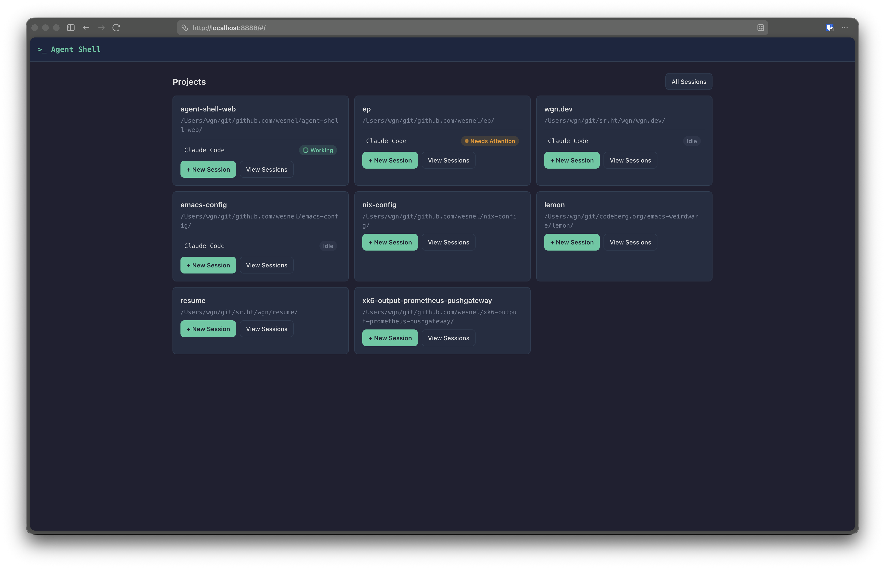
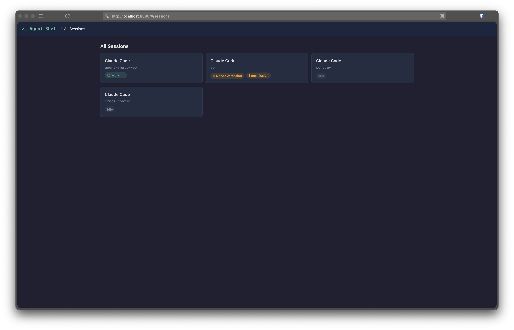
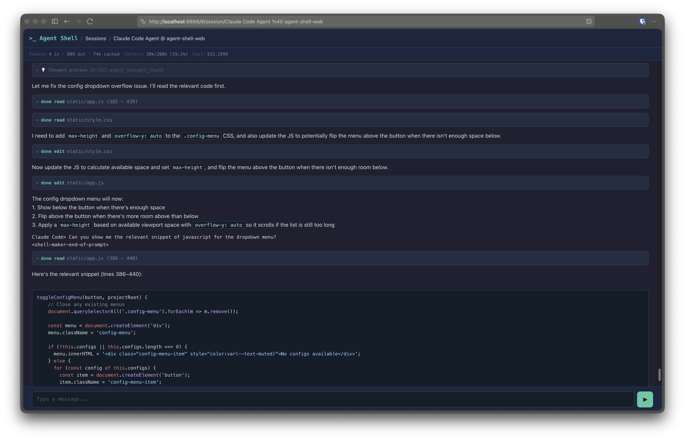
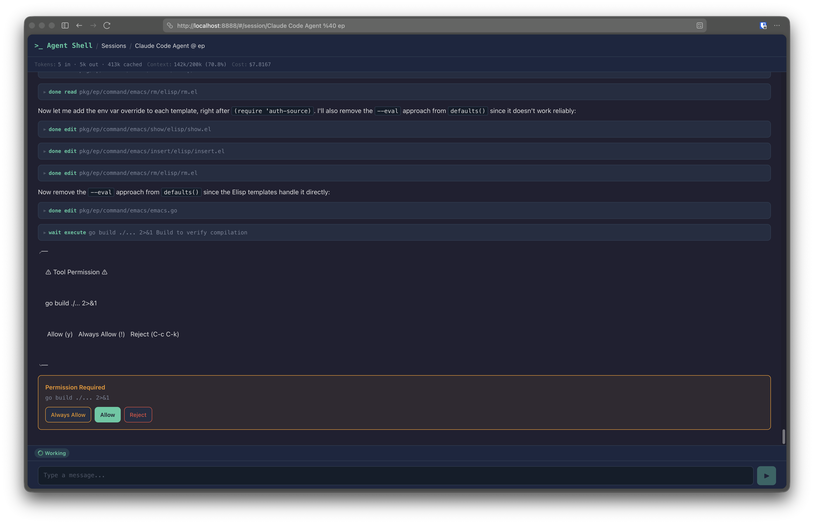

# agent-shell-web

A web-based UI for [agent-shell](https://github.com/xenodium/agent-shell) sessions, hosted entirely from within Emacs. Manage AI agent sessions from your phone or any browser — view chat history, send messages, and approve or deny permission requests remotely.

## Features

- **Project browser** — lists all known projects from Emacs `project.el` and lets you spawn new agent-shell sessions in any project
- **Session management** — view all running agent-shell sessions globally or filtered by project, with live busy/idle status indicators
- **Chat view** — full session transcript with a message input bar, auto-scrolling, and real-time polling for updates
- **Permission handling** — pending tool permission requests (file writes, command execution, etc.) surface as action cards with Allow / Reject / Always Allow buttons
- **Stuck session detection** — sessions blocked on unanswered permissions are flagged so you never miss one
- **Installable PWA** — add to your phone's home screen for an app-like experience with background notifications when a session needs attention
- **Mobile-first design** — dark terminal-aesthetic theme, large touch targets, safe-area support for notched devices

## Screenshots

| Projects | Session List | Chat View | Permission Dialog |
|----------|-------------|-----------|-------------------|
|  |  |  |  |

## Architecture

The entire backend is a single Emacs Lisp file (`agent-shell-web.el`) that implements an HTTP server using Emacs's built-in `make-network-process`. It serves both a REST API and the static frontend files. No external dependencies beyond `agent-shell` itself are required — no Node.js, no npm, no bundler.

```
agent-shell-web/
  agent-shell-web.el       Emacs Lisp HTTP server + REST API
  static/
    index.html             Single-page application shell
    style.css              Mobile-first CSS
    app.js                 Router, API client, views, polling
    sw.js                  Service worker (caching + notifications)
    manifest.json          PWA manifest
    icon-192.svg           App icon (192x192)
    icon-512.svg           App icon (512x512)
```

## Prerequisites

- Emacs 28+ with [agent-shell](https://github.com/xenodium/agent-shell) installed and configured
- At least one agent configuration in `agent-shell-agent-configs` (e.g. Claude Code)

## Usage

### Start the server

From within Emacs:

```
M-x agent-shell-web-start
```

Or via emacsclient:

```sh
emacsclient -e '(progn (load "/path/to/agent-shell-web/agent-shell-web.el") (agent-shell-web-start))'
```

The server starts on port 8888 by default. Pass a numeric argument to use a different port:

```
C-u 9999 M-x agent-shell-web-start
```

Then open <http://localhost:8888> in any browser.

### Stop the server

```
M-x agent-shell-web-stop
```

### Remote access via ngrok

To access from your phone:

```sh
ngrok http 8888
```

Open the ngrok URL on your phone and use "Add to Home Screen" to install as a PWA. You'll be prompted to enable notifications — these fire when a session is stuck waiting for permission approval.

## API

| Method | Path | Description |
|--------|------|-------------|
| `GET` | `/api/projects` | List known projects from `project.el` |
| `GET` | `/api/configs` | List available agent configurations |
| `GET` | `/api/sessions` | List running sessions (optional `?project=` filter) |
| `POST` | `/api/sessions` | Create a new session (`project_root`, `config_identifier`) |
| `GET` | `/api/sessions/<name>` | Session detail: chat content, permissions, usage stats |
| `POST` | `/api/sessions/<name>/message` | Send a message to a session |
| `POST` | `/api/sessions/<name>/permission` | Approve or deny a pending permission |
| `GET` | `/api/sessions/<name>/poll` | Lightweight status for change detection |
| `GET` | `/api/status` | Global status across all sessions (used by service worker) |

## How it works

- The HTTP server uses `make-network-process` with `:server t` to create a TCP listener. Each incoming connection accumulates data via a filter function until a complete HTTP request is received, then routes it to the appropriate handler.
- Chat content is extracted from agent-shell buffers via `buffer-substring-no-properties`, giving the same text the user sees in Emacs.
- Permission options are captured by advising `agent-shell--on-request` to intercept `session/request_permission` ACP requests and store the available options. When the user responds via the web UI, `agent-shell--send-permission-response` is called with the selected option.
- The frontend polls the lightweight `/poll` endpoint every 1.5 seconds and only re-fetches the full session content when something has changed.
- The service worker polls `/api/status` every 10 seconds and shows a notification when a session has pending permissions, even if the app is in the background.

## License

See [LICENSE](LICENSE) for details.
